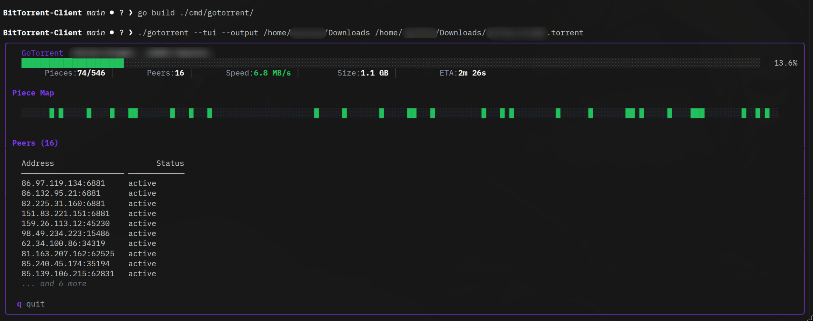
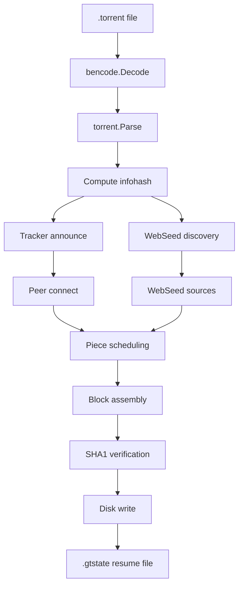

# GoTorrent

GoTorrent is a BitTorrent client written in Go. It implements torrent parsing, tracker announces, peer wire handling, piece scheduling, resume state, and HTTP WebSeed downloads. The TUI uses [Bubble Tea](https://github.com/charmbracelet/bubbletea) for the terminal interface.



## Features

- `.torrent` parsing with raw `info` dict hashing
- HTTP and UDP tracker support
- TCP peer handshake and BitTorrent wire protocol
- rarest-first piece selection with endgame fallback
- SHA1 verification and disk writes
- resume state saved as `.gtstate`
- WebSeed support via BEP 17 and BEP 19
- Bubble Tea TUI for live progress

## Layout

```text
cmd/gotorrent/        CLI entrypoint
internal/bencode/     Bencode encoder and decoder
internal/torrent/     Torrent metainfo parsing and infohash logic
internal/tracker/     HTTP and UDP tracker clients
internal/peer/        Handshake, wire messages, and peer connections
internal/piece/       Piece scheduler, writer, resume state
internal/webseed/     HTTP WebSeed sources
internal/tui/         Bubble Tea UI
```

## Build

```bash
go build ./cmd/gotorrent/
```

## Run

```bash
# CLI
./gotorrent --output /downloads path/to/file.torrent

# TUI
./gotorrent --tui --output /downloads path/to/file.torrent

# Custom listen port
./gotorrent --port 6881 --output /downloads path/to/file.torrent
```

## Test

```bash
go test ./...
go test ./... -race -count=1
```

## Architecture



## Current Limits

- DHT
- PEX
- magnet links
- BitTorrent v2
- uTP
- rate limiting

## License

MIT © 2026 Karthik Das

See [LICENSE.md](LICENSE.md) for the full text.
