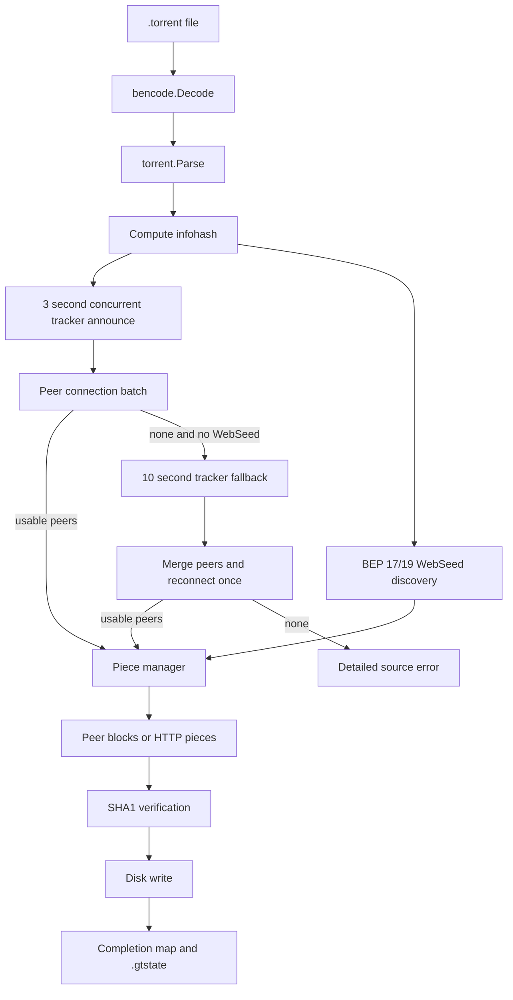

# GoTorrent

GoTorrent is a BitTorrent client written in Go. It implements torrent parsing, tracker announces, peer wire handling, piece scheduling, resume state, and HTTP WebSeed downloads. The TUI uses [Bubble Tea](https://github.com/charmbracelet/bubbletea) for the terminal interface.


## Features

- `.torrent` parsing with raw `info` dict hashing
- concurrent HTTP and UDP tracker discovery with bounded fallback
- TCP peer handshake, connection diagnostics, and BitTorrent wire protocol
- rarest-first piece selection with endgame fallback
- SHA1 verification and disk writes
- resume state saved as `.gtstate`
- WebSeed support via BEP 17 and BEP 19
- Bubble Tea TUI that starts before discovery and reports exact progress, speed, and ETA

## Layout

```text
cmd/gotorrent/        CLI entrypoint
internal/bencode/     Bencode encoder and decoder
internal/torrent/     Torrent metainfo parsing and infohash logic
internal/tracker/     Concurrent HTTP/UDP announces and peer discovery
internal/peer/        Handshake, wire messages, and peer connections
internal/piece/       Scheduling, verification, writer, and resume state
internal/webseed/     HTTP WebSeed sources
internal/tui/         Bubble Tea UI
```

## Build

```bash
go build -o gotorrent ./cmd/gotorrent
```

## Run

```bash
# CLI
./gotorrent --output /downloads path/to/file.torrent

# TUI
./gotorrent --tui --output /downloads path/to/file.torrent

# Custom listen port
./gotorrent --port 6881 --output /downloads path/to/file.torrent
```

## Test

```bash
go test ./...
go test ./... -race -count=1
```

## Architecture



Tracker announces return candidate addresses, not guaranteed connections. GoTorrent first announces to every tracker concurrently with a three-second budget. If no peer connects and no WebSeed is available, it performs one ten-second fallback announce, merges and deduplicates both peer sets, and attempts one final connection batch.

The client uses one peer ID for tracker announces and all handshakes. Once a peer connection starts, one writer goroutine serializes every outbound wire message.

Progress and throughput are intentionally separate: verified piece bytes drive completion, while accepted peer and WebSeed payload bytes feed a rolling three-second speed calculation.

## Not Yet Supported

- DHT
- PEX
- periodic tracker reannounce
- magnet links
- BitTorrent v2
- uTP
- rate limiting

## License

MIT © 2026 Karthik Das

See [LICENSE.md](LICENSE.md) for the full text.
